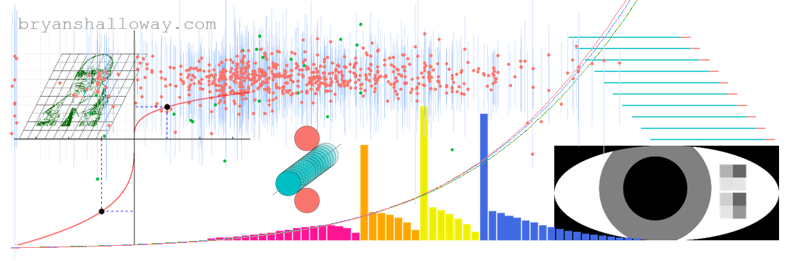

I was considering replacing my professional social media banner with an image that was a mash up of a bunch of figures from my blog overlaid. Unfortunately, the end result looked dumb...

Only useful thing was learned how to make images transparent using [magick](https://github.com/ropensci/magick). Example can be found in r/make-images-transparent.R